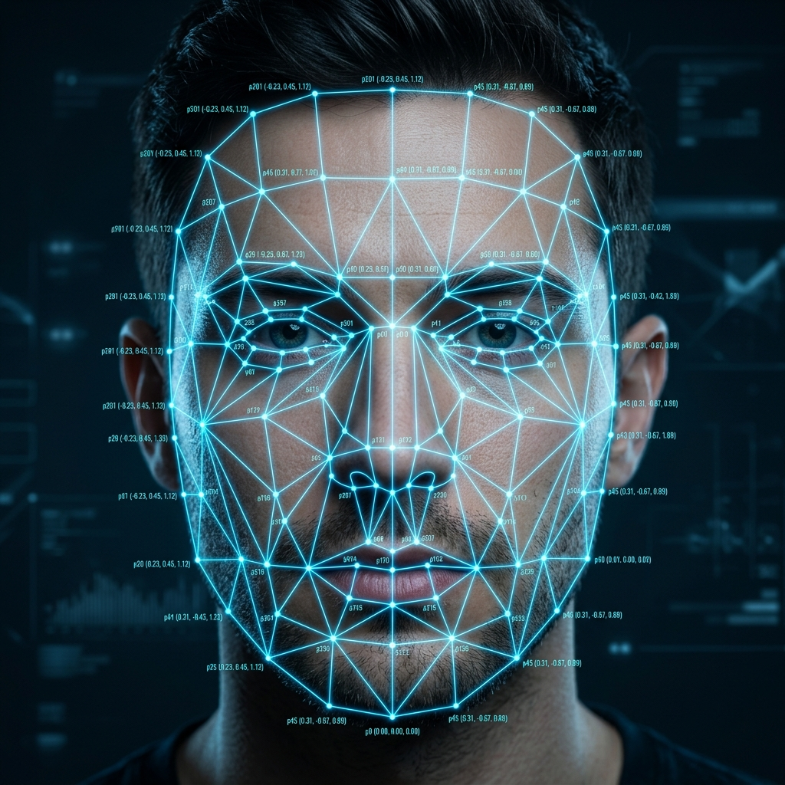
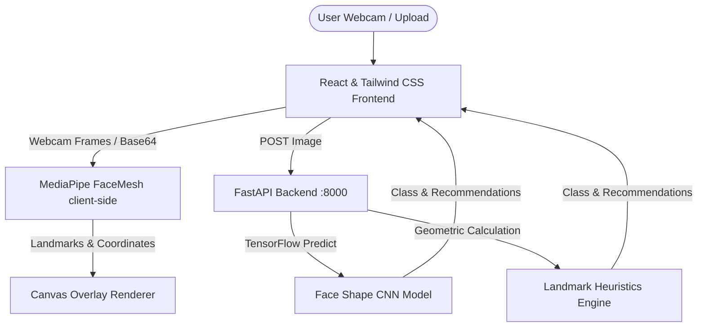

# VTO Enterprise: AI-Powered Virtual Try-On

An advanced, interactive **AI-Driven Virtual Try-On (VTO)** web application for eyewear. The project leverages **TensorFlow/Keras** deep learning models, **MediaPipe Face Mesh**, and real-time computer vision to classify face shapes, estimate Pupillary Distance (PD), recommend matching frame styles, and render 3D-aligned 2D glasses overlays in real-time.

---

## 🚀 Key Features

*   **Real-time Webcam Try-On:** Automatically detects faces, tracks movement, and overlay frames with precise scaling and rotation matching the head angle.
*   **Static Image Upload:** Upload a photo to analyze facial structures and try on glasses statically.
*   **AI Face Shape Classification:** Utilizes a custom TensorFlow convolutional neural network (`face_shape_model_final.h5`) to classify faces into 6 distinct shapes: **Oval, Round, Square, Heart, Oblong, and Diamond**.
*   **Heuristic Fallback Engine:** Features a geometric calculation engine that parses facial landmark ratios (Forehead, Cheek, and Jaw width, plus Face Length) to determine shape matches in case the backend model is offline.
*   **Pupillary Distance (PD) Estimation:** Computes pupil-to-pupil distance in millimeters using iris landmark geometry calibrated to the human average iris diameter (11.7mm).
*   **Smart Style Recommendations:** Recommends frame shapes tailored to the user's face shape (e.g., Round face receives recommendations for Square, Wayfarer, and Rectangular glasses).
*   **Enterprise E-Commerce Suite:** Fully featured UI including a product catalog, interactive adjustments panel (for scale and offsets), compare modes, and an integrated shopping cart.

## 🧬 Face Mesh & Virtual Overlay

The application maps facial structures using a high-density 468-point 3D landmark mesh to align the eyeglasses frames precisely. Once aligned, the virtual frames are mapped onto the user's face with correct scaling and rotation:

<p align="center">
  
  
</p>

---

## 🛠️ Architecture & Tech Stack



### **Frontend**
*   **Core Logic:** React (UMD & Babel compiler), HTML5 Canvas.
*   **Styling:** Tailwind CSS, Google Fonts (`DM Sans`).
*   **Libraries:** [MediaPipe Face Mesh](https://google.github.io/mediapipe/solutions/face_mesh.html), Lucide Icons, MediaPipe Camera Utils.

### **Backend**
*   **Framework:** FastAPI (Python 3.9+).
*   **AI Frameworks:** TensorFlow/Keras, OpenCV-Python, NumPy.
*   **Tracking & Mesh:** Mediapipe (Python wrapper).

### **Model Training**
*   **Pipeline:** Located in `TrainingCode/KaggleNotebookTrainingOfVirtualTryOn.txt`.
*   **Source Data:** UTKFace dataset, with manual labeling tools and geometric auto-labeling pipelines.
*   **Model Architecture:** Custom CNN trained on preprocessed 300x300 facial crops.

---

## ⚙️ Installation & Running

### **1. Run the Backend**

Ensure you have Python 3.9+ installed.

```bash
# Navigate to the backend directory
cd backend

# Create and activate virtual environment (Optional but Recommended)
python -m venv .venv
# On Windows:
.venv\Scripts\activate
# On macOS/Linux:
source .venv/bin/activate

# Install dependencies
pip install -r requirements.txt

# Run the FastAPI server
uvicorn backend:app --host 127.0.0.1 --port 8000 --reload
```

The backend server will run at `http://127.0.0.1:8000`.

### **2. Run the Frontend**

Because the frontend uses modern modules and webcam tools, it needs to be served by a local HTTP server.

```bash
# Navigate to frontend directory
cd ../frontend

# Start a simple Python HTTP server
python -m http.server 3000
```

Open your browser and navigate to **`http://localhost:3000`**.

---

## 📐 Mathematical Heuristics

### **Pupillary Distance (PD) Estimation**
The camera estimates the physical distance in millimeters by using the scale ratio of the user's iris:
$$\text{mm Per Pixel} = \frac{11.7\text{ mm}}{\text{Iris Diameter (pixels)}}$$
$$\text{PD (mm)} = \text{Pupil Distance (pixels)} \times \text{mm Per Pixel}$$

### **Geometric Face Shape Ratios**
1.  **Face Ratio:** $\text{Face Length} / \text{Cheekbone Width}$
2.  **Jaw Ratio:** $\text{Jawline Width} / \text{Cheekbone Width}$
3.  **Forehead Ratio:** $\text{Forehead Width} / \text{Cheekbone Width}$

Based on these landmarks:
*   **Oblong:** $\text{Face Ratio} > 1.55$
*   **Round:** $\text{Face Ratio} < 1.35$ with soft jawlines
*   **Square:** $\text{Jaw Ratio} > 0.92$
*   **Heart/Diamond:** $\text{Jaw Ratio} < 0.70$ and wider foreheads

---

## 🖥️ Demo UI & Interactions

*   **Mode Toggle:** Switch between live camera feedback and static uploaded files.
*   **Fine-tuning Controls:** Sliders to adjust frame Scale, horizontal (X) and vertical (Y) offsets for an absolute fit.
*   **Compare View:** Double-check different frames side-by-side.
*   **Shopping Cart:** Save favorite frames, check total prices, and checkout in-app.

---

Developed with ❤️ using TensorFlow, FastAPI, and React.
